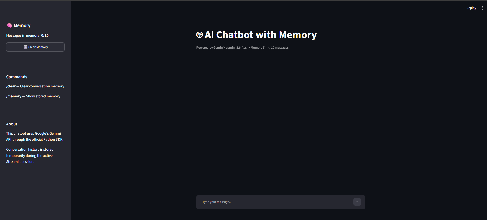
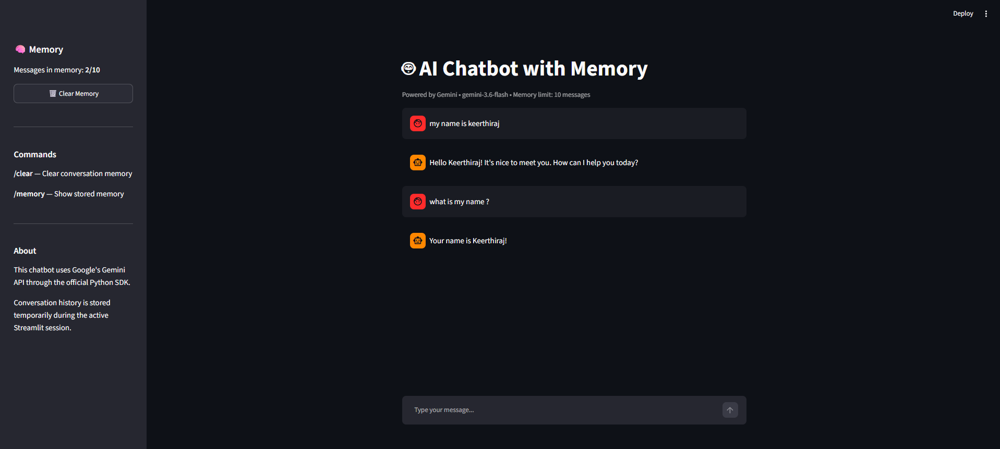
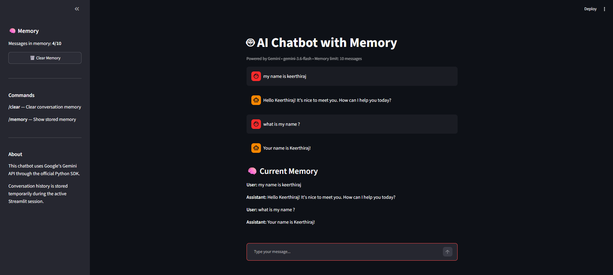

# 🤖 AI Chatbot with Memory

A conversational AI chatbot built with **Python, Streamlit, Google's Gemini API, and the official Google GenAI Python SDK**.

The chatbot maintains an in-memory conversation history during an active Streamlit session, allowing the AI to remember previous messages and preserve conversational context.

## 🚀 Features

- 💬 Interactive Streamlit chat interface
- 🧠 In-memory conversation history
- 🔄 Context-aware conversations
- 🤖 Google Gemini API integration
- 🔑 Secure API key management using `.env`
- 📦 Official `google-genai` Python SDK
- 🗑️ Clear conversation memory
- 🔍 View stored memory using `/memory`
- ⚙️ Configurable memory limit
- 💻 Lightweight Python implementation

## 📸 Screenshots

### 1. Chatbot Interface



### 2. Memory Demonstration



### 3. Conversation Memory



## 🧠 How Memory Works

The chatbot maintains conversation history using Streamlit session state.

The flow is:

User Message
↓
Conversation History
↓
Gemini API
↓
AI Response
↓
Conversation History

Every user message and AI response is appended to the in-memory conversation history.

The stored history is sent with subsequent requests so Gemini can maintain conversational context.

## 🛠️ Technologies Used

- Python
- Streamlit
- Google Gemini API
- Google GenAI Python SDK
- python-dotenv

## 📁 Project Structure

```text
AI-Chatbot-With-Memory/
│
├── .env.example
├── .gitignore
├── README.md
├── app.py
├── streamlit_app.py
├── requirements.txt
├── demo-1.png
└── demo-2.png